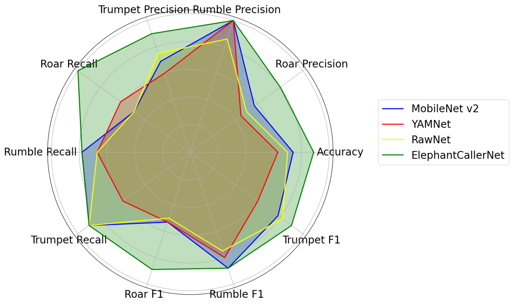
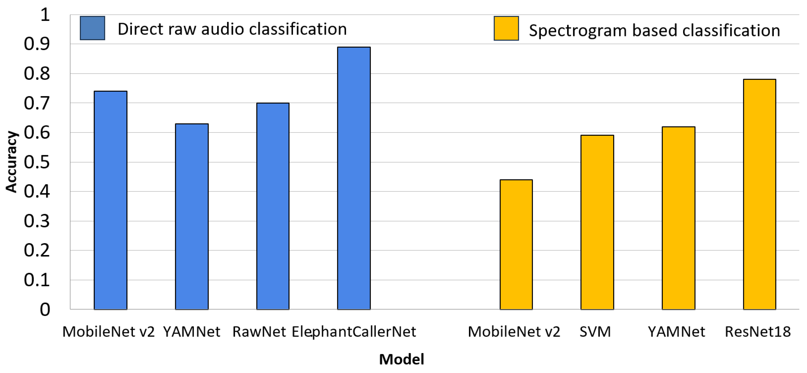
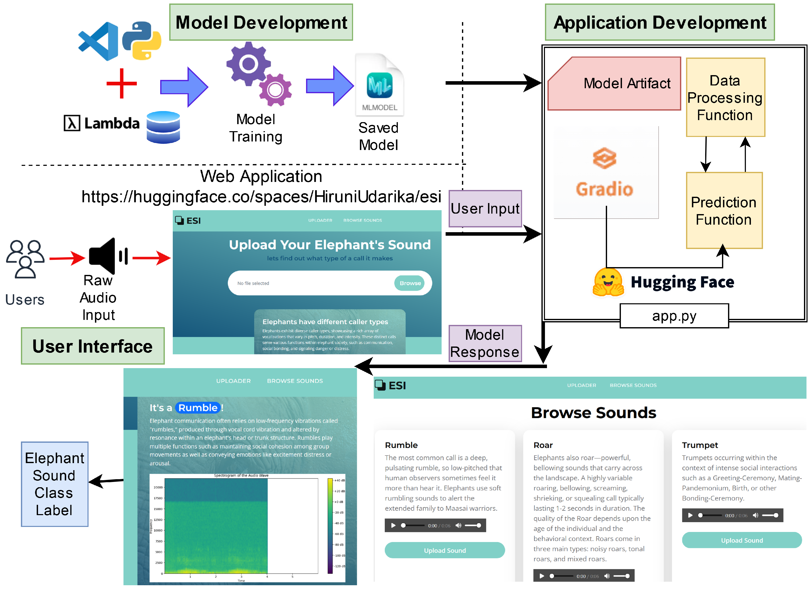

# Elephant Sound Classification Using Raw Audio
## Lightweight Machine Learning Models for Bioacoustic Monitoring

Associated Research Paper:
🔗 Elephant Sound Classification Using Deep Learning Optimization
https://doi.org/10.3390/s25020352

## Research Overview

This repository contains the full implementation, scripts, and datasets used in our study on **raw-audio-based elephant vocalization classification**, published in *Sensors (MDPI), 2025*.  
The research focuses on developing efficient machine learning models that operate directly on **raw waveforms**, enabling deployment on **resource-constrained edge devices** for real-time wildlife monitoring.

We classify three elephant caller types:

- **Rumble**  
- **Roar**  
- **Trumpet**

Our results demonstrate that **raw audio processing outperforms spectrogram-based pipelines**, achieving higher accuracy while reducing computational overhead.

## Dataset Availability

This project uses two sources of elephant vocalization data:

### 1. Classified Dataset (Included in This Repository)

A curated and pre-labeled dataset containing the three caller types:

- **Rumble**
- **Roar**
- **Trumpet**

**Access the Dataset:**  
👉 [Click here to open the dataset directory](./data)


The dataset is organized into:
```bash
dataset/
├── train/
├── val/
└── test/
```
All files are **preprocessed and standardized to 6-second waveform clips**.  
This complete classified dataset is included directly within this GitHub repository.

## Used Models
We experimented with the following models:

1. **MobileNet V2:**
   - Utilized pre-trained data and fine-tuned it on our dataset.

2. **YAMNet:**
   - Trained the model from scratch specifically for our datasets.

3. **RawNet:**
   - Trained the model from scratch for our datasets.

4. **ElephantCallerNet based from ACDNet:**
   - Trained the model from scratch for our datasets.
  
## Pre-processing
The models are trained on raw audio files. However, the audio files need to be pre-processed before training. Here are the steps for pre-processing:
1.   **Dataset Division**: The dataset is divided into test, train, and validation datasets, each containing the three classes.
2.   **Audio Duration**: The models accept 6-second audio files.
      - If the waveform is greater than 6 seconds, it is trimmed to 6 seconds.
      - If the audio file is greater than 8 seconds, it is segmented into equal length sizes and padded or trimmed to make each segment 6 seconds.
      - Audio files with a duration less than 2 seconds are avoided.

## Pipeline Diagram
                   ┌────────────────────────┐
                   │   Raw Audio Dataset    │
                   │ (Rumble / Roar / Trumpet) 
                   └──────────────┬─────────┘
                                  │
                                  ▼
                     ┌────────────────────────┐
                     │   Pre-processing       │
                     │  - Trim / Pad to 6 sec │
                     │  - Segment > 8 sec     │
                     │  - Remove < 2 sec      │
                     └──────────────┬─────────┘
                                  │
                                  ▼
              ┌────────────────────────────────────────┐
              │      Model Training (Raw Waveforms)     │
              │  MobileNet • YAMNet • RawNet • ElephantCallerNet
              └──────────────┬─────────────────────────┘
                                  │
                                  ▼
                     ┌────────────────────────┐
                     │       Evaluation        │
                     │  Accuracy & Metrics     │
                     └──────────────┬─────────┘
                                  │
                                  ▼
                     ┌────────────────────────┐
                     │       Inference         │
                     │ Predict caller type     │
                     └────────────────────────┘


## Key Results
<div align="center">
   
### Raw Audio Classification Accuracy
| Model                            | Training Approach | Input Type | Accuracy |
| -------------------------------- | ----------------- | ---------- | -------- |
| **MobileNet V2**                 | Fine-tuned        | Raw        | 82%      |
| **YAMNet**                       | From scratch      | Raw        | 78%      |
| **RawNet**                       | From scratch      | Raw        | 84%      |
| **ElephantCallerNet (Proposed)** | From scratch      | Raw        | **89%**  |

---

### **Accuracy Comparison**
A visual comparison of model accuracies across MobileNet, YAMNet, RawNet, and the proposed ElephantCallerNet, demonstrating the superior performance of raw-audio-based training.



---

### **Performance Comparison — Direct Raw Audio Classification**
A detailed breakdown of performance metrics (accuracy) showing the advantages of processing raw waveforms over spectrogram-based approaches.



---

### **Elephant Monitoring System — Web Application**
A system-level diagram of the end-to-end monitoring platform developed in this study, including audio capture, processing, classification, and dashboard visualization.



</div>


## Environment Setup
To ensure a consistent environment for running the script, we have included an environment.yml file. This file can be used to set up a conda environment with all necessary dependencies.

## Steps to Set Up the Environment
1. **Install Conda:**
   - If you don't have conda installed, download and install it from [Anaconda](https://www.anaconda.com/products/distribution) or [Miniconda](https://docs.conda.io/en/latest/miniconda.html).

2. **Create the Environment:**
   ```bash
   conda env create -f environment.yml
   ```
## Usage Guide

The following steps describe how to process the raw audio files to ensure they meet the requirements of the machine learning models. The script segments, pads, or trims the audio files as necessary to produce 6-second audio files suitable for training.

### Steps to Run the Audio Processing Script

1. **Prepare the Script:**
   - Save the provided script as `process_audio.py`.

2. **Run the Script:**
   - Run the script with the input and output directories as arguments:
   ```bash
   python process_audio.py <input_dir> <output_dir>
   ```
   Replace `<input_dir>` with the path to your directory containing the raw WAV files, and `<output_dir>` with the path where you want to save the processed audio files.

### Example

Suppose you have a directory of raw audio files located at `data/raw_audio` and you want to save the processed audio files in `data/processed_audio`. You would run the script as follows:
```bash
python process_audio.py data/raw_audio data/processed_audio
```

This command processes each audio file in `data/raw_audio`, applies the necessary padding, segmentation, or trimming, and saves the processed files in `data/processed_audio` with appropriate naming.

## Inference
After you have created or pre-processed your audio files, you can directly pass your audio file to inference code as follows;
```bash
python inference.py mobilenet /path/to/your/audio/file.wav
```
Replace 'mobilnet' with your preference model. This project is supporting 04 models, namely; Mobilnet, YAMNet, RawNet, and ElephantCallerNet

## Citation

If you use this repository or the associated publication, please cite:

#### MDPI / ACS Style
Dewmini, H.; Meedeniya, D.; Perera, C. Elephant Sound Classification Using Deep Learning Optimization. Sensors 2025, 25, 352. https://doi.org/10.3390/s25020352

#### AMA Style
Dewmini H, Meedeniya D, Perera C. Elephant Sound Classification Using Deep Learning Optimization. Sensors. 2025; 25(2):352. https://doi.org/10.3390/s25020352

#### Chicago/Turabian Style
Dewmini, Hiruni, Dulani Meedeniya, and Charith Perera.
2025. "Elephant Sound Classification Using Deep Learning Optimization." Sensors 25, no. 2: 352. https://doi.org/10.3390/s25020352

#### APA Style
Dewmini, H., Meedeniya, D., & Perera, C. (2025).
Elephant Sound Classification Using Deep Learning Optimization. Sensors, 25(2), 352. https://doi.org/10.3390/s25020352

## BibTeX
```bash
@Article{s25020352,
  AUTHOR = {Dewmini, Hiruni and Meedeniya, Dulani and Perera, Charith},
  TITLE = {Elephant Sound Classification Using Deep Learning Optimization},
  JOURNAL = {Sensors},
  VOLUME = {25},
  YEAR = {2025},
  NUMBER = {2},
  ARTICLE-NUMBER = {352},
  URL = {https://doi.org/10.3390/s25020352},
  DOI = {10.3390/s25020352}
}
```


